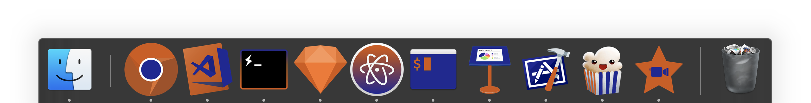
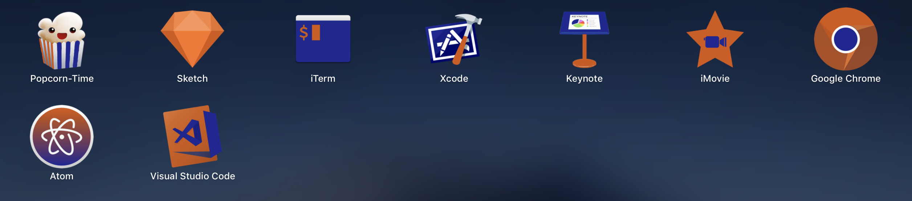
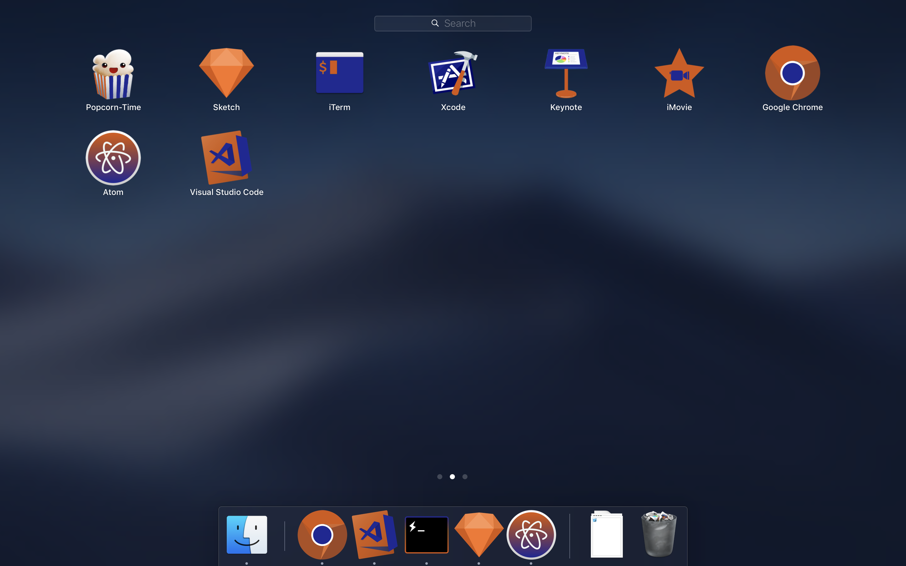

	 
	
	 
	 
	<b>My Apps Logos</b>
	 

Since my computer is mine (🙃) and I do what I want I decided to change my apps logs with my owns colors, probably you won't like it, but I do!

     
	
	
	
	
   

I have edited some of my apps logos adding my custom colors:

 

 

### Palette:

|  | Orange | #D6570B |
| :-: | :-: | :-: | 
|  | Blue | #232496 |

## Wanna try it?

Donwload the images and change your apps icons, that's it!

## Team

|[![Carlos Abraham Logo][abranhe-img]][abranhe]|
| :-: |
| [Carlos Abraham][abranhe] |

## License

[WTFPL][license] License © [Carlos Abraham][abranhe]

<!-------------------- Links ------------------------>
[abranhe]: https://github.com/abranhe
[abranhe-img]: https://avatars3.githubusercontent.com/u/21347264?s=50
[license]: https://github.com/abranhe/my-apps/blob/master/license
